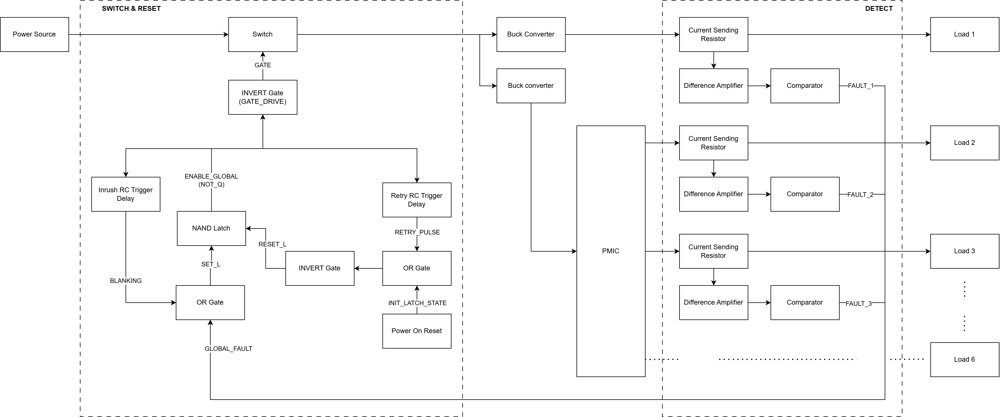

# Macro-SEL Detection and Recovery

A **hardware-only, autonomous protection system** for an ARM Cortex-A72 Edge Computer in LEO orbit. Detects and recovers from Macro Single Event Latchup (MacroSEL) events across 6 power rails — no firmware, no supervisory controller.

---

## Functional Overview



On a latchup event, current on any protected rail exceeds 150% of its rated value. The protection system detects this within **3.64 µs**, latches the fault, cuts power via a master P-FET, and automatically retries after ~1 second.

---

## Mission Profile

| Parameter | Value |
|-----------|-------|
| Orbit | LEO ~400 km |
| Mission life | 3-year minimum |
| TID environment | ~3–15 krad/year (shielding-dependent) |
| All-IC TID rating | ≥ 30 krad(Si) |
| LET hardness | 43–46 MeV·cm²/mg |

---

## Protected Power Rails

Trip threshold: **150% of rated current** on each rail.

| Rail | Voltage | Rated Current | Load | Shunt | Trip Current |
|------|---------|---------------|------|-------|-------------|
| 1 | 3.3 V | 5 A | AI Core #1 | 10 mΩ | 7.5 A |
| 2 | 3.3 V | 5 A | AI Core #2 | 10 mΩ | 7.5 A |
| 3 | 1.2 V | 3 A | CPU + DDR4 | 10 mΩ | 4.5 A |
| 4 | 1.35 V | 400 mA | CPU | 50 mΩ | 0.6 A |
| 5 | 1.8 V | 2 A | CPU + eMMC | 10 mΩ | 3.0 A |
| 6 | 2.5 V | 1 A | CPU + DDR4 | 10 mΩ | 1.5 A |

> Rail 4 uses 50 mΩ instead of 10 mΩ to achieve 300 kHz bandwidth (1.16 µs rise time) without excessive amplifier gain.

---

## Signal Flow

1. **Shunt resistor** — converts rail current to a millivolt-level differential voltage
2. **Stage 1: Difference amplifiers** (OPA4H838-SEP) — amplify shunt voltage to ~988 mV at trip point
3. **Stage 2: Comparators** (TLV1704-SEP, open-drain) — compare amplified signal to V_ref; pull shared wired-AND bus LOW on fault
4. **Wired-AND bus** — any single fault drives GLOBAL_FAULT LOW
5. **Blanking timer** (SN54SC6T17-SEP, 12–18 ms) — masks inrush false faults at startup
6. **SR latch** (SN54SC4T00-SEP) — latches fault state; holds ENABLE_GLOBAL LOW even after rails collapse
7. **Retry timer** (SN54SC6T17-SEP, τ = 2.2 s) — fires RETRY_PULSE ~0.79 s after fault, resets latch, attempts recovery
8. **Gate driver** (SN54SC6T14-SEP) — drives master P-FET gate; fail-safe OFF if driver loses power
9. **Master FET** (BUP06CP038F-01, P-channel) — switches all protected rails simultaneously

### Total Fault Response Time: 3.64 µs

| Stage | Delay |
|-------|-------|
| Amplifier rise (worst case, Rail 6) | 2.30 µs |
| Comparator propagation | 0.56 µs |
| Logic gates (OR + SR latch + inverter) | ~0.03 µs |
| P-FET turn-off (worst-case 3τ) | 0.75 µs |

---

## Bill of Materials

| Ref | Part | Function | Qty |
|-----|------|----------|-----|
| Q1 | BUP06CP038F-01 | Master P-FET (−35 A cont., −140 A pulsed, 38 mΩ R_DS(on)) | 1 |
| U_AMP_A/B | OPA4H838-SEP | Quad op-amp — current sense amplifier | 2 |
| U_CMP_A/B | TLV1704-SEP | Quad comparator — open-drain output | 2 |
| U_LATCH | SN54SC4T00-SEP | Quad NAND — SR latch | 1 |
| U_OR | SN54SC4T32-SEP | Quad OR — SET_L + RESET_L logic | 1 |
| U_SCH | SN54SC6T17-SEP | Hex Schmitt — blanking timer + retry timer | 1 |
| U_INV | SN54SC6T14-SEP | Hex Schmitt inverter — gate driver + reset logic | 1 |
| Q_dis | JANSR2N3700UB | NPN — retry timer capacitor discharge | 1 |
| R_shunt (×5) | WSL2512R0100FEA | 10 mΩ ±1%, 2 W, Kelvin 4-wire | 5 |
| R_shunt (×1) | WSL2512R0500FEA | 50 mΩ ±1%, 2 W, Kelvin 4-wire (Rail 4) | 1 |

**Power**: Single 5 V spacecraft bus rail. Total consumption ~6.5 mA @ 5 V = **33 mW** (0.13% of 25 W system budget).

---

## Repository Structure

```
latchup_design/
├── AICRAFT_latchup_detect_recover.pdf       # Formal design document (authoritative)
├── MacroSEL_v4_Complete.docx                # Supporting reference
├── latchup_detect_recover.drawio            # draw.io source
├── latchup_detect_recover-*.drawio.png      # Sub-block diagrams
├── latchup_v4.0/                            # Component datasheets (flight parts)
│   ├── application_notes/                   # Referenced app notes
│   └── prototype_commercial_parts/          # Commercial equivalents for lab testing
└── latchup_v3.1/                            # Historical datasheets (v3.1)
```

### Circuit Diagrams

| File | Sub-block |
|------|-----------|
| `latchup_detect_recover-FUNCTIONAL_DIAGRAM.drawio.png` | Top-level system overview |
| `latchup_detect_recover-current_sense_amplifier.drawio.png` | Stage 1 difference amplifier |
| `latchup_detect_recover-comparator.drawio.png` | Stage 2 comparator |
| `latchup_detect_recover-Wired_AND_bus.drawio.png` | Open-drain fault aggregation |
| `latchup_detect_recover-NAND_SR_latch.drawio.png` | Fault state memory |
| `latchup_detect_recover-reference_voltage.drawio.png` | V_ref resistor divider |
| `latchup_detect_recover-power_on_reset.drawio.png` | Power-on reset |
| `latchup_detect_recover-delay_startup.drawio.png` | Startup blanking timer |
| `latchup_detect_recover-delay_retry.drawio.png` | Retry timer |
| `latchup_detect_recover-retry_pulse_gen.drawio.png` | Retry pulse generator |
| `latchup_detect_recover-set_fault_latched.drawio.png` | Set/reset OR logic |
| `latchup_detect_recover-gate_driver.drawio.png` | P-FET gate driver |
| `latchup_detect_recover-test_bench.drawio.png` | Test bench |

---

## Design Philosophy

- **Hardware-only** — no microcontroller, no firmware, no single point of software failure
- **Fail-safe OFF** — master FET turns off if gate driver loses power (10 kΩ pull-up to 5 V)
- **Every component justifies its existence** — no redundant logic, no speculative features
- **Single power domain** — all protection circuits powered from 5 V spacecraft bus, independent of protected rails
